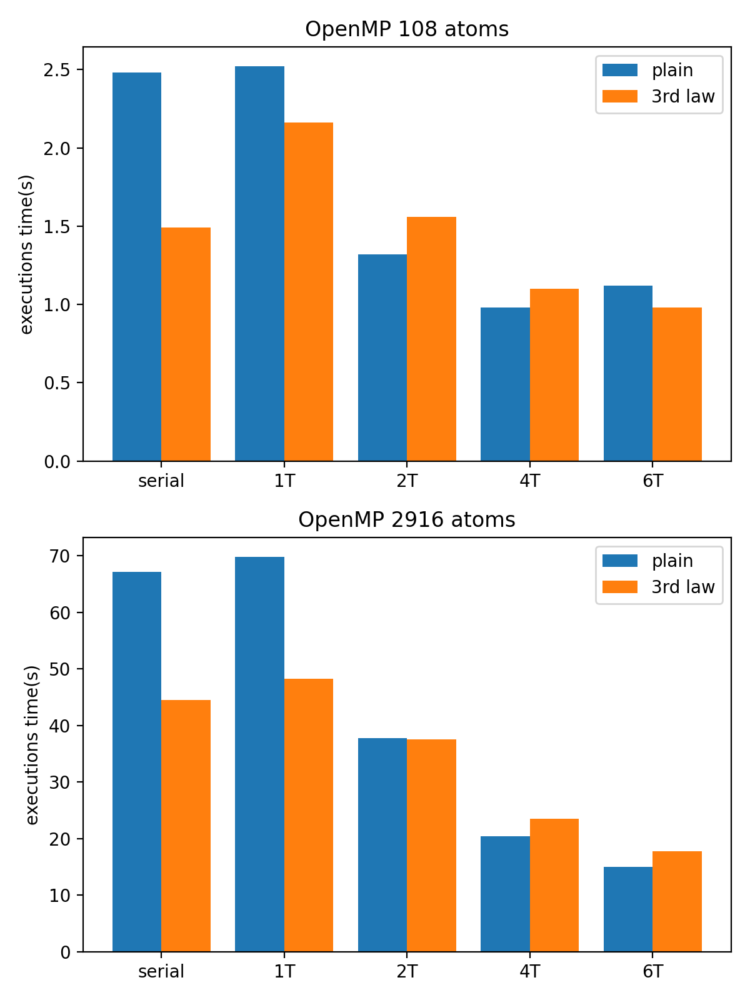

# LJMD OpenMP parallelization
by Alessandro Masini (mapenzo-ph)

Repository for the code: https://github.com/mapenzo-ph/ljmd

To compile the code using OpenMP, from the main directory (where the CMakeLists.txt is):

- mkdir build && cd build
- cmake -DUSE_OMP=1 ..
- cmake --build .

## Parallelization strategy
The parallelization has been carried out in two times. First I performed a naive parallelization of the base code, without serial optimizations and 3rd law implementation. This required modifying the following changes/additions to the serial code:

- `verlet1` / `verlet2` : added a `#pragma parallel for` to the for loop.
- `ekin` : added a `#pragma omp parallel for` to the loop and a `reduction(+:ekin)` to correctly compute the value of the kinetic energy adding the contributions of all threads.
- `force` : added a `#pragma omp parallel for` to parallelize the outer loop in the force computation, and a `reduction(+:epot)` to correctly compute the value of the potential energy adding the contributions of each thread.

Subsequently, after merging the changes from the serial optimization part, the `force` function was modified again. The inner loop of the force computation was modified to make use of the 3rd law, thus i had to add `#pragma omp critical` clauses to the force updates, in order to prevent concurrent accesses to the same memory locations.

Finally the merge with the MPI parallelization was perfmormed. Since the MPI code required a lot of extra structures and modifications to the functions, the merge strategy was to keep both versions of the code, and adding a compilation flag to select which kind of parallelization to adopt.

## OpenMP LJMD benchmarking
In the following I provide code execution times for both the initial naive OpenMP parallelization, and the subsequent 3rd law augmented version. The tests were performed both on Argon 108 and Argon 2916 input files (respctively 108 atoms 10^4 steps, and 2916 atoms, 10^3 steps). The tests were carried out on my laptop, which features a 2.6GHz 6‑core 9th Gen Intel Core i7, using 1, 2, 4, 6 threads.

As we can see, the data suggest that the naive OpenMP parallelization is generally a bit faster than the one with 3rd law when using more than one thread. This is due to the `#pragma omp atomic` clauses having a lot of overhead and reducing the gain of the multithreaded approach. On the other hand, using the 3rd law provides a considerable gain in serial execution times. Clearly, the serial code is faster than the parallel code run on a single thread, once again due to the presence of the overhead from the `atomic` clauses, which is absent in the serial code. however, for small systems (108 atoms) the serial code may even be faster than the parallel code run on more than one thread (as we can see from the serial being faster than the two-threaded version for 108 atoms). For bigger systems this effect is mitigated by the amount of computations to be performed, and we obtain a valuable gain from our parallelization, especially when using 4 or more threads (but there is not much gain by using more than 4 cores). Using 4 threads may be the sweet spot for the OpenMP parallelization, if one plans to use it along an orthogonal MPI parallelization.

